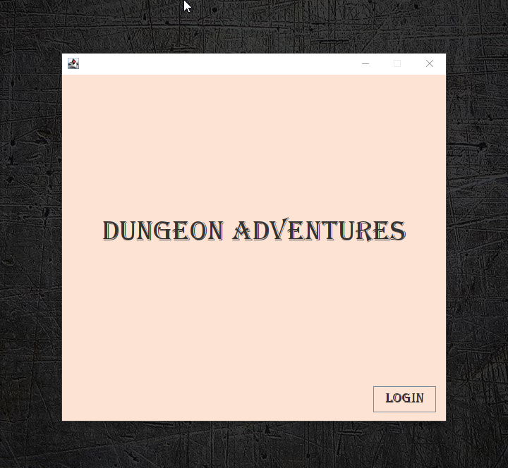
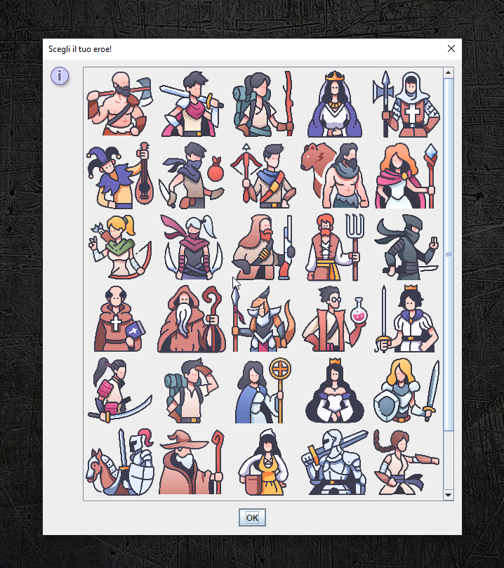
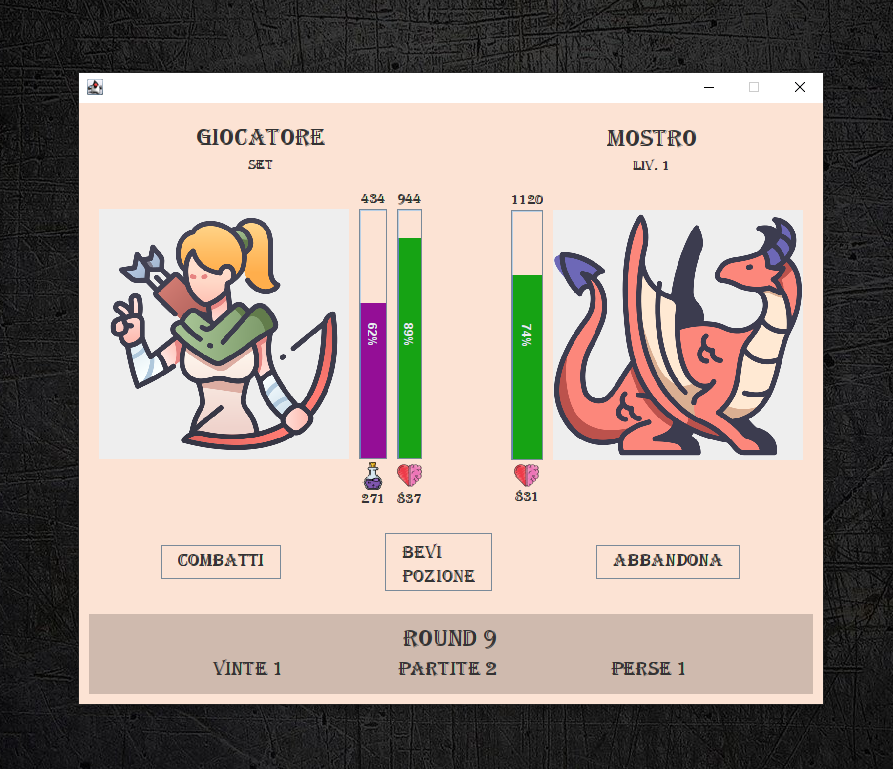
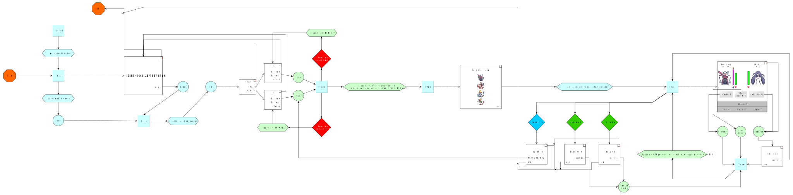

# Assignment 6
# Dungeon adventures

  

> # Gameplay
> 
> The player loads his profile by entering his username and password or creates one.
>
> In the case of a new profile, the player chooses his / her hero / heroine.
>
> The aim of the game is to arrive alive at the end of the repeated fights, i.e. the player's health must be greater than 0.
>
> A tie occurs if both the player and the monster have 0 health after a fight.
>
> The game is divided into games, each game is in turn divided into rounds.
>
> At each round the player can choose whether to fight or drink the potion, in the latter case his health is increased in proportion to the potion drunk.
>
> The level of the monster faced increases as you progress through the games.
>
---

## IMPLEMENTATION:

> The program is divided into two sub-processes, a client and a server;
>
> the client is represented by the main process, it takes care of starting the server,
> initializing and managing the graphic window and interacting with the player;
>
> the server is a process started internally by the main process,
> it deals with interacting with the client's requests, simulating the phases of the game
> (combat, drinking potion, victory, draw, defeat, abandonment), and managing the database;
>
> the database has two states, a virtual one represented by the state of the ram memory during the game,
> or by the state of the Map and List instances,
> and a physical one represented by the database.db and logins.db files stored on disk;
>
> the data stored on the database disk is encrypted;
> 
> ## The program also accepts the following extra parameters:
>
> | parameter             | description|
> | --------------------- | ---------- |
> | `--debug`             | To enable verbose debugging printing and the number of occurrences for each individual file |
> | `-ea`                 | To enable assertions in the client process |
> | `--assert`            | To enable assertions in the server process |
> 
>
> The program structure follows the MVC (Model-view-controller) pattern
> which is implemented through the model, view, and controller packages.
>
> An additional security package is used to implement data encryption,
> while the Assignment and Server classes are included outside the MVC packages.
>
> Communication between server and client follows the following protocol:
> 
> ### CLIENT TO SERVER PROTOCOL
> 
>     IdResponse:LoginRecord
>     IdResponse:UserRecord
>     IdResponse:LoginUserRecord
> 
> ### SERVER TO CLIENT PROTOCOL
> 
>     IdResponse:UserRecord
>     IdResponse:error_message
> 
> ---
>     LoginRecord     :: = username,password
>     UserRecord      :: = Player;Monster;matches,won,lost,round,message
>     LoginUserRecord :: = username,password|Player;Monster;matches,won,lost,round,message
> 
> ### Example (pseudocode) client to server:
>     PrintWriter.println (IdResponse.index + ":" + DataServerProvider.toDataServer ());

## Dependencies
- utils.jar

### compilation
    $ git clone https://github.com/JoeFerri/Laboratorio_di_Reti-A.A.2022-23
    $ cd ../path/to/the/file/assignment_6/src
    $ javac -cp ./../lib/gf.jar ./external/*.java ./external/com/baeldung/aes/*.java ./assignment_6/*.java ./assignment_6/controller/*.java ./assignment_6/model/*.java ./assignment_6/view/dialogs/*.java ./assignment_6/view/frames/*.java ./assignment_6/view/panels/*.java ./assignment_6/security/crypto/*.java -d ./../build

### running
    $ cd ../path/to/the/file/assignment_6/build

    $ java [-ea] -cp ".;./../lib/gf.jar" assignment_6.Assignment [--debug] [--assert] [<porta>:int from 3000 to 4000]  # Windows
    $ java -cp ".;./../lib/gf.jar" assignment_6.Assignment                            # Windows
    $ java -ea -cp ".;./../lib/gf.jar" assignment_6.Assignment --debug --assert 3334  # Windows

    $ java [-ea] -cp ".:./../lib/gf.jar" assignment_6.Assignment [--debug] [--assert] [<porta>:int from 3000 to 4000]  # Unix
    $ java -cp ".:./../lib/gf.jar" assignment_6.Assignment                            # Unix
    $ java -ea -cp ".:./../lib/gf.jar" assignment_6.Assignment --debug --assert 3334  # Unix

## Process flow map

<a href="https://raw.githubusercontent.com/JoeFerri/Laboratorio_di_Reti-A.A.2022-23/main/assignment_6/assets/schema.svg">Direct link schema.svg</a> <b>(issue: no pictures are shown)</b>
 
<a href="https://raw.githubusercontent.com/JoeFerri/Laboratorio_di_Reti-A.A.2022-23/main/assignment_6/assets/schema.png">Direct link schema.png</a> <b>(pictures ok)</b>
  

    
## Documentation
For the documentation see the notes inside the source code or [wiki page](https://github.com/JoeFerri/Laboratorio_di_Reti-A.A.2022-23/wiki)

### Code of conduct
[ENG](code_of_conduct-eng.md)

[ITA](code_of_conduct-ita.md)

# Credits

## Icon images

### License
see https://www.flaticon.com

### Authors
The icon images are designed by:

[maxicons](https://www.flaticon.com/authors/maxicons)

[freepik](https://www.flaticon.com/authors/freepik)

[juicy-fish](https://www.flaticon.com/authors/juicy-fish)

---
## Core Java Security Algorithms

### License
MIT license

### References
[Tutorial](https://www.baeldung.com/java-aes-encryption-decryption)

### Source
[AES GitHub](https://github.com/eugenp/tutorials/tree/master/core-java-modules/core-java-security-algorithms)

# License 

## General license 

GNU Affero General Public License v3.0 only

  Copyright (C) 2022 Giuseppe Ferri

  assignment_6 is free software: you can redistribute it and/or modify
  it under the terms of the GNU Affero General Public License as
  published by the Free Software Foundation, either version 3 of the
  License, or (at your option) any later version.
  
  assignment_6 is distributed in the hope that it will be useful,
  but WITHOUT ANY WARRANTY; without even the implied warranty of
  MERCHANTABILITY or FITNESS FOR A PARTICULAR PURPOSE.  See the
  GNU Affero General Public License for more details.
  
  You should have received a copy of the GNU Affero General Public License
  along with this program (see file COPYING).  If not, see <http://www.gnu.org/licenses/>.
